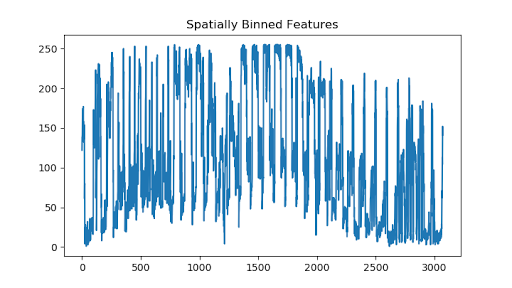
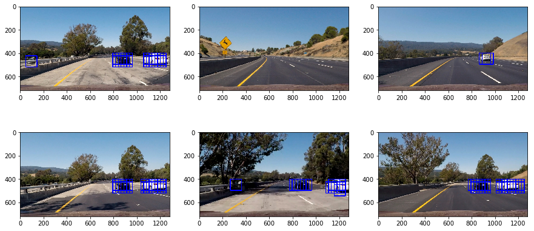
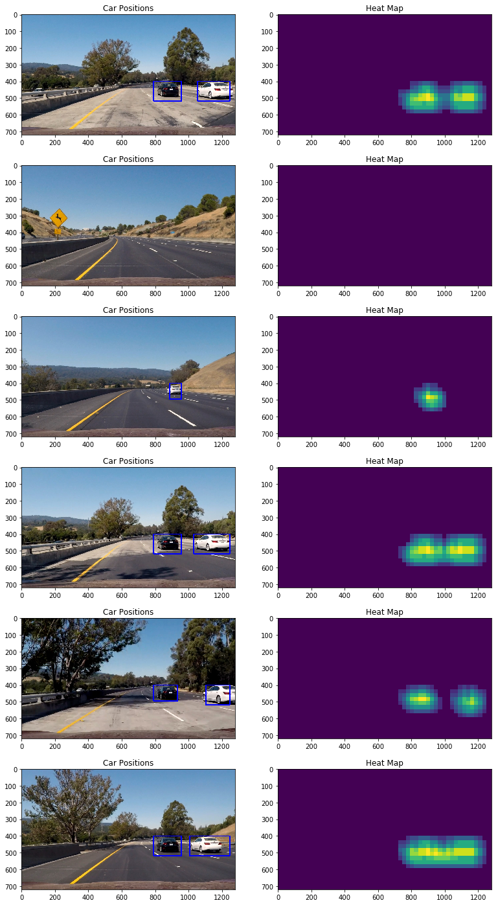
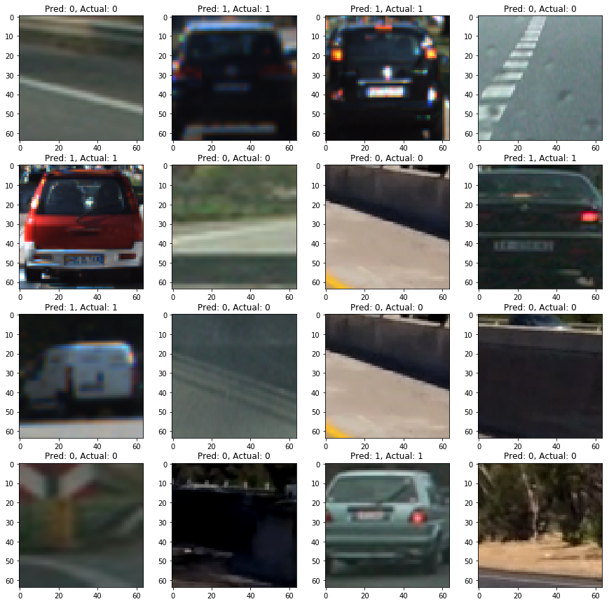

# Vehicle Detection
[](http://www.udacity.com/drive)


<p align="center">
 <a href="https://youtu.be/z0a5T5eXJgg"></a>
 <br>Click for full video
</p>

---

**Vehicle Detection Project**


---

Table of Contents (updating)
=================

   * [Goal](#goal)
   * [Code & Files](#code-and-files)
   * [Pipeline using Machine Learning](#pipeline-using-machine-learning)
      * [Feature Extraction](#feature-extraction)
          * [Histogram of Oriented Gradients](#histogram-of-oriented-gradients)
          * [Spatial Binning of Color](#spatial-binning-of-color)
          * [Histogram of Color](#histogram-of-color)
          * [Combined Features](#combined-features)
      * [Training Classifier](#training-classifier)
          * [Linear SVM](#linear-SVM)
          * [Random Forest](#random-forest)
      * [Car Searching](#car-searching)
          * [Sliding Window Search](#sliding-window-search)
          * [Heatmap Thresholding](#heatmap-thresholding)
      * [Output](#Output)
          * [Test Images](#test-images)
          * [Video](#video)
   * [Pipeline using Deep Learning](#pipeline-using-deep-learning)
      * [Image Preprocessing](#image-preprocessing)
      * [Training Classifier](#training-classifier)
          * [ConvNet](#convnet)
          * [Prediction Visualisation](#prediction-visualisation)
      * [Pipeline](#pipeline)
          * Sliding window
          * Heatmap Thresholding
          * Output
      * [Final Video Output](#final-video-output)
   * [Discussion](#discussion)
---

# Goal

The goals / steps of this project are the following:

* Perform a Histogram of Oriented Gradients (HOG) feature extraction on a labeled training set of images and train a classifier Linear SVM classifier
* Optionally, apply a color transform and append binned color features, as well as histograms of color, to HOG feature vector.
* Implement a sliding-window technique and use your trained classifier to search for vehicles in images.
* Run pipeline on a video stream (start with the test_video.mp4 and later implement on full project_video.mp4) and create a heat map of recurring detections frame by frame to reject outliers and follow detected vehicles.
* Estimate a bounding box for vehicles detected.

[//]: # (Image References)
[image1]: ./examples/car_not_car.png
[image2]: ./examples/HOG_example.jpg
[image3]: ./examples/sliding_windows.jpg
[image4]: ./examples/sliding_window.jpg
[image5]: ./examples/bboxes_and_heat.png
[image6]: ./examples/labels_map.png
[image7]: ./examples/output_bboxes.png
[video1]: ./project_video.mp4


---

# Code and Files

You're reading this project! This Project repo contains the following code files:

* [utils.py](./utils.py) The script containing functions to extract features from images.
* [ML-clf.ipynb](./ML-clf.ipynb) The notebook containing exploration on feature extraction and pipeline using Random Forest as Classifier.
* [ConvNet.ipynb](./ConvNet.ipynb) The notebook containing pipeline using ConvNet as Classifier which is used for the final output.
* [ConvNet.h5](./ConvNet.h5) The ConvNet model trained for the pipeline.
* [extract_udacity_data.ipynb](./extract_udacity_data.ipynb) The notebook containing exploration and extraction dataset from Udacity.
* [README.md](./README.md) You are reading it! The links to video output are also included in this README.

# Pipeline using Machine Learning

## Feature Extraction

### Histogram of Oriented Gradients

Extracting HOG features from images can be quite helpful to distinguish vehicles and non-vehicles. The code for this step is contained in function `get_hog_features` in [utils.py](./utils.py).

I started by reading in all the `vehicle` and `non-vehicle` images.  Here is an example of one of each of the `vehicle` and `non-vehicle` classes:

![alt text][image1]

I then explored different color spaces and different `skimage.hog()` parameters (`orientations`, `pixels_per_cell`, and `cells_per_block`).  I grabbed random images from each of the two classes and displayed them to get a feel for what the `skimage.hog()` output looks like.


Here is an example using the `YCrCb` color space and HOG parameters of `orientations=8`, `pixels_per_cell=(8, 8)` and `cells_per_block=(2, 2)`:


![alt text][image2]

#### Final choice of HOG parameters.

I tried various combinations of parameters and the combination below seemed to work pretty well:

```
color_space = 'YCrCb' # Can be RGB, HSV, LUV, HLS, YUV, YCrCb
orient = 9  # HOG orientations
pix_per_cell = 8 # HOG pixels per cell
cell_per_block = 2 # HOG cells per block
hog_channel = 'ALL' # Can be 0, 1, 2, or "ALL"
```

### Spatial Binning of Color
I computed Spatial Binning of YCrCb channels using function `bin_spatial` in [utils.py](./utils.py) which gives this result:



I extracted spatial binning feature to be one part of my feature vector.

### Histogram of Color
I construct histograms of RGB channels using function `color_hist` in [utils.py](./utils.py) which gives this result:


Then I stacked the three histograms to be one part of my feature vector.

### Combined Features

I stacked the three features extracted into one feature vector and normalized it to prevent any feature from dominating the classification.

Here is an example of the normalized feature vector:


## Training Classifier

### Liner SVM
My first try was a simply linear SVM using sklearn in the 5th cell of the [notebook](./ML-clf.ipynb) for a balance of accuracy and speed to test my pipeline.

A linear SVM with default setting can easily achieve 0.98+ test accuracy using 20% of the data. Then instead of fine-tuning the parameters, I decided to try other types of classifier first.

### Random Forest
A Random Forest classifier has been proven to have good performance of accuracy and speed. Again, I built a RF classifier with almost all default parameters. I set `n_estimators` to be 120 since I have quite a large number of features.

Surprisingly, the test accuracy went to 1.0 directly. I suspected high chance of overfitting here. So I decided to move on to building my pipeline and validate my classifier using the pipeline.

## Car Searching

With a classifier built, my next step is to search for vehicles in the image. My approach used is Sliding Window Search.

### Sliding Window Search


I decided to search random window positions at random scales all over the image and came up with this:

![alt text][image3]

ok just kidding I didn't actually ;)

---

To implement this sliding window search, I set a window size to be 64*64 since my training images are in 64*64. And because I guess we don't really need to search for vehicles in the sky (well, really? hum.. at least at this moment, we don't need ;) So I only searched between 400 and 656 of y-axis.

And in order to search more efficiently, I implemented a scaled window searching in `find_cars` in class `VehicleDector` as visualized below:


I chose a scale of 2 so it will be more efficient. Below is the example output on the 6 test images:




### Heatmap Thresholding


Ultimately I searched on two scales using YCrCb 3-channel HOG features plus spatially binned color and histograms of color in the feature vector, which provided a nice result.  However, I was still obtaining some false negatives. In order to get rid of those false negatives, I implemented a heatmap thresholding in function `find_hearmap` and `apply_threshold` in class `VehiclesDetector` in the [notebook](./ML-clf.ipynb).

I then used `scipy.ndimage.measurements.label()` to identify individual blobs in the heatmap.  I then assumed each blob corresponded to a vehicle.  I constructed bounding boxes to cover the area of each blob detected.  

#### Here are six frames and their corresponding heatmaps:

![alt text][image5]

### Here is the output of `scipy.ndimage.measurements.label()` on the integrated heatmap from all six frames:
![alt text][image6]

### Here the resulting bounding boxes are drawn onto the last frame in the series:
![alt text][image7]

---

## Output

### Test Images
The final pipeline outputs on the six test images:



### Video

And here is the output video using the Random Forest Classifier without any tuning yet.

<p align="center">
 <a href="https://youtu.be/Rz8r4_qigSY"></a>
 <br>Click for full video
</p>

Alright, my pipeline is working and the output looks pretty for the first try. Because I feel that I have better intuition into Deep Learning so I decided to build a ConvNet as my classifier.

---

# Pipeline using Deep Learning

The code can be found in this [notebook](./ConvNet.ipynb).

## Image Preprocessing
To train the ConvNet, my training data should be in the form of images directly. The data from GTI are already 64*64 images. In order to augment the data, I extracted some car images from Udacity data. This process can be found in the [extrac_udacity_data.ipynb](./extract_udacity_data.ipynb).

Also, for each frame of the data, I flipped it over using `np.fliplr(img)` to gain additional data to make it more robust.

## Training Classifier

### ConvNet
Here is the architecture of my ConvNet model:
```
_________________________________________________________________
Layer (type)                 Output Shape              Param #   
=================================================================
conv2d_1 (Conv2D)            (None, 30, 30, 8)         608       
_________________________________________________________________
leaky_re_lu_1 (LeakyReLU)    (None, 30, 30, 8)         0         
_________________________________________________________________
dropout_1 (Dropout)          (None, 30, 30, 8)         0         
_________________________________________________________________
conv2d_2 (Conv2D)            (None, 26, 26, 16)        3216      
_________________________________________________________________
leaky_re_lu_2 (LeakyReLU)    (None, 26, 26, 16)        0         
_________________________________________________________________
max_pooling2d_1 (MaxPooling2 (None, 13, 13, 16)        0         
_________________________________________________________________
conv2d_3 (Conv2D)            (None, 11, 11, 64)        9280      
_________________________________________________________________
leaky_re_lu_3 (LeakyReLU)    (None, 11, 11, 64)        0         
_________________________________________________________________
max_pooling2d_2 (MaxPooling2 (None, 5, 5, 64)          0         
_________________________________________________________________
conv2d_4 (Conv2D)            (None, 3, 3, 128)         73856     
_________________________________________________________________
leaky_re_lu_4 (LeakyReLU)    (None, 3, 3, 128)         0         
_________________________________________________________________
flatten_1 (Flatten)          (None, 1152)              0         
_________________________________________________________________
dense_1 (Dense)              (None, 1088)              1254464   
_________________________________________________________________
leaky_re_lu_5 (LeakyReLU)    (None, 1088)              0         
_________________________________________________________________
dropout_2 (Dropout)          (None, 1088)              0         
_________________________________________________________________
dense_2 (Dense)              (None, 128)               139392    
_________________________________________________________________
leaky_re_lu_6 (LeakyReLU)    (None, 128)               0         
_________________________________________________________________
dropout_3 (Dropout)          (None, 128)               0         
_________________________________________________________________
dense_3 (Dense)              (None, 32)                4128      
_________________________________________________________________
leaky_re_lu_7 (LeakyReLU)    (None, 32)                0         
_________________________________________________________________
dense_4 (Dense)              (None, 2)                 66        
=================================================================
Total params: 1,485,010
Trainable params: 1,485,010
Non-trainable params: 0
_________________________________________________________________
```

### Prediction Visualisation

The parameters for training:
```
optimizer = 'adam'
epochs = 15
batch_size = 64
callbacks = keras.callbacks.ModelCheckpoint('model.h5', monitor='val_loss', save_best_only=True)
```

Here is the training loss:


And prediction visualization:


## Pipeline

Except the classifier part, the remaining pipeline is the same as described above using sliding window search and heatmap thresholding.

## Final Video Output

<p align="center">
 <a href="https://youtu.be/z0a5T5eXJgg"></a>
 <br>Click for full video
</p>


# Discussion


Overall, my classifier using ConvNet is working reasonably. I think one big improvement could be extract images of cars from the project video. I end up with not doing so is because I don't want overfit my classifier. Later I shall implement some techniques to track detected bounding boxes and add some smoothing to obtain a better output.

Also, there are some recent research on real-time object detection such as [Mask R-CNN](https://arxiv.org/abs/1703.06870), [YOLO(You Only Look Once)](https://pjreddie.com/darknet/yolo/) which we should check out.
